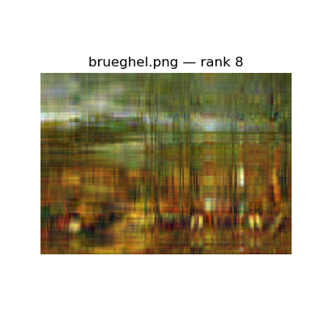

# TSVD-Based Image Compression

This project demonstrates **image compression using Truncated Singular Value Decomposition (TSVD)** implemented **entirely from scratch**, without using high-level linear algebra libraries.

##  Overview

Two distinct images—a **Brueghel classical painting** and a **Mandrill photograph**—were compressed at varying TSVD ranks. The aim was to explore how reconstruction quality and storage requirements change as the approximation rank increases.

- TSVD applied independently on RGB channels  
- Power iteration + deflation used to estimate top singular vectors  
- Frobenius norm used to evaluate reconstruction error  
- Compression vs quality trade-off analyzed

##  Method

Given an image matrix \( A \in \mathbb{R}^{m \times n} \), we compute:
A ≈ A_r = U_r Σ_r V_rᵀ

The approximation is performed **separately for R, G, and B channels**, followed by merging.

- Covariance matrix: \( A^T A \)
- Top eigenvectors via power iteration
- Orthogonal deflation after each iteration
- Reconstructed image = recombined RGB channels

## 📊 Results

### Brueghel Painting Reconstructions

| Rank 2 | Rank 8 | Rank 32 |
|--------|--------|---------|
|  |  |  |

### Mandrill Face Reconstructions

| Rank 4 | Rank 8 | Rank 32 |
|--------|--------|---------|
|  |  |  |

### Reconstruction Error vs Rank

- The **Mandrill image** compresses more efficiently (steeper error decline).
- The **Brueghel painting** requires higher rank to preserve detailed textures.

## 💾 Storage Efficiency

Original image size:  
\[
3 \times m \times n
\]

Compressed image size (rank \( r \)):  
\[
3r(m + n + 1)
\]

Even at rank 16, over **80% reduction** in storage is possible with acceptable quality.

## 📌 Conclusions

- TSVD is highly effective for structured images with distinct features (e.g. Mandrill)
- Rich-textured images (e.g. Brueghel) require higher ranks
- Compression quality is tunable by rank — useful for bandwidth-limited systems

## 📁 Files

- `tsvd_compression_complete.ipynb`: Full Python implementation
- Image outputs: reconstruction samples for ranks 2–64
- `mandrill_vs_brueghel_error.png`: Error vs rank comparison plot
- `numeric_term_project_report.pdf`: Detailed report

## 👨‍💻 Author

**Ömer Faruk San**  
Department of AI and Data Engineering  
Istanbul Technical University  
📧 san22@itu.edu.tr

